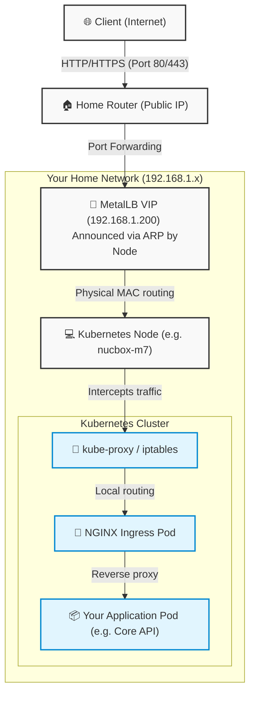

# meIOT ArgoCD Deploy

ArgoCD configuration repository for deploying the meIOT Core API service using Helm charts stored in Azure Container Registry.

## Repository Structure

```
├── applications/
│   └── core-api/
│       └── argocd.yaml          # Core API ArgoCD Application manifest
├── helm/
│   └── core-api/
│       └── values.yaml          # Helm values for Core API deployment
└── README.md
```

## Overview

This repository contains the GitOps configuration for meIOT using ArgoCD and Helm. It uses a dual-repository pattern:
- **Chart Repository**: Azure Container Registry (`meiot.azurecr.io/helm/meiot-helm-chart`) - stores the Helm chart template
- **Values Repository**: This repository contains the environment-specific values and configuration

## Chart Details

- **Chart Name**: dot-net-chart
- **Version**: 1.0.1
- **Registry (OCI ACR)**: oci://meiot.azurecr.io/meiot-helm-chart
- **Release Name**: core-api
- **Target Namespace**: meiot

## Configuration

Edit `helm/core-api/values.yaml` to customize:
- Container image repository and version (points to meiot.azurecr.io)
- Azure Container Registry credentials (imagePullSecrets)
- External secret store configuration (Vault backend)
- MongoDB and Kafka connection details
- Resource requests and limits
- Ingress hostname and TLS settings

## Key Settings

**Image Configuration:**
- Registry: `meiot.azurecr.io`
- Repository: `meiot-core-api`
- Tag: `v1.0`
- Pull Secret: `azurecr-secret`

**External Secrets:**
- Store: Vault backend
- MongoDB credentials: meiot-core-api-mongo-user, meiot-core-api-mongo-pass

**Resources:**
- Memory: 256Mi (request) / 512Mi (limit)
- CPU: 250m (request) / 500m (limit)

**Ingress:**
- Hostname: core-api.meiot.local
- TLS: Enabled with Let's Encrypt

## Deployment

This repository is automatically synced by ArgoCD. The core-api application will be deployed to the `meiot` namespace with the Helm values specified in this repository.

### Prerequisites
- ArgoCD installed and configured
- Kubernetes cluster with meiot namespace
- Azure Container Registry credentials configured
- Vault backend for external secrets management
- MongoDB and Kafka services running in meiot namespace

## Network Traffic Flow (MetalLB & NGINX Ingress)

Here is a conceptual diagram of how external requests flow into the Kubernetes cluster when hitting public endpoints via NGINX ingress:



**Step-by-Step Flow:**
1. **The Internet to your Router:** External traffic hits the router's Public IP on port 80/443.
2. **Router to the MetalLB Virtual IP (VIP):** Port Forwarding sends packets to the MetalLB IP (`192.168.1.200`).
3. **MetalLB to the Kubernetes Node:** The MetalLB Speaker broadcasts via ARP that it handles `192.168.1.200`, routing the packet to a specific Kubernetes node.
4. **Node into the NGINX Pod:** Because `externalTrafficPolicy: Local` is used, the node's network layer immediately sends the packet to the **NGINX Ingress Controller pod** sitting on that exact node (preserving original source IP).
5. **NGINX to Application:** NGINX matches the Host/Path, acting as a reverse proxy, and correctly forwards traffic directly to the backend application pod's internal cluster IP.

## Troubleshooting & Diagnostics

If you need to verify where traffic is routing, you can use these standard `kubectl` commands:

### 1. Check MetalLB IP Address Pools
To see the IP ranges MetalLB is allowed to hand out:
```bash
kubectl get ipaddresspool -n metallb-system
```

### 2. Find Services using a LoadBalancer
To see which services have requested an IP from MetalLB:
```bash
kubectl get svc -A | grep LoadBalancer
```

### 3. Check exactly what internal Pod IPs the LoadBalancer routes to
MetalLB routes the VIP to internal Pod endpoints. To see those target IPs:
```bash
kubectl get endpoints -n ingress-nginx nginx-ingress-ingress-nginx-controller
```

### 4. Verify the exact Pod
Match the ENDPOINTS IP from the previous step with the actual Pod IP to trace the routing:
```bash
kubectl get pods -n ingress-nginx -o wide
```

## Architecture FAQ: MetalLB & NGINX

**Why do we give MetalLB an IP range (.200 to .250)?**
MetalLB allocates IPs for Kubernetes `LoadBalancer` services. It assigns the first available IP (`.200`) to our NGINX Ingress Controller. We provide a range so that if we ever need to expose purely non-HTTP services (like a database or raw TCP socket) on a completely dedicated IP address, MetalLB has a pool to pull from (`.201`, `.202`, etc.).

**Why funnel all traffic through NGINX first?**
MetalLB is a **Layer 4** load balancer; it only understands IPs and Ports. If we didn't use NGINX, we would have to assign a dedicated Public IP to every single application in the cluster.
NGINX is a **Layer 7** load balancer. It acts as the "receptionist." It reads the HTTP `Host` header (e.g., `argocd.meiot.site`) and knows exactly which app to forward it to, allowing us to host dozens of URLs safely on a single IP (`.200`).

**Does NGINX balance load directly to the backend pods?**
Yes, it does! NGINX bypasses the standard Kubernetes `ClusterIP` network abstraction and talks directly to the backend workload Pods. If you scale your application to 3 identical pods, NGINX constantly tracks their direct IP addresses and load balances user traffic efficiently across all three instances.
